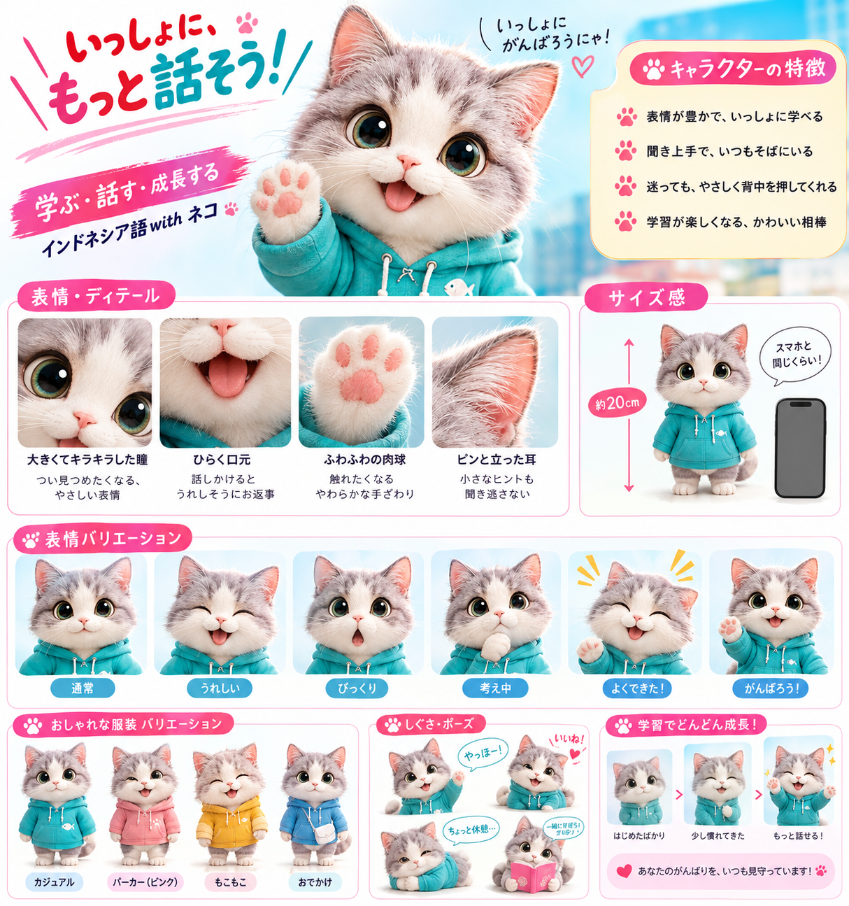

# デザインシステム

## 1. デザインの方向性

キーワードは「明るい」「安心」「一緒に進む」「音声に集中できる」である。親しみやすさはキャラクターと柔らかい形で表現し、問題画面では情報量を抑える。子供向け玩具のようにしすぎず、成人が毎日使える清潔さを保つ。

避けるもの:

- 暗い背景を常用すること
- ネオン色の大量使用
- 過度なグラデーションと影
- 正解を推測させる装飾
- 学習操作を隠す大型キャラクター
- 失敗を責める、連続記録の喪失を脅す表現

## 2. キャラクター

### 2.1 基本形

- 種別: 白〜薄灰の子猫
- 目: 大きく、緑〜青緑の虹彩、明るいハイライト
- 顔: 小さなピンクの鼻、柔らかい白い口元
- 耳: 立ち耳、内側は淡いピンク
- 肉球: 柔らかいピンク
- 服: ターコイズのパーカー、白い紐、小さな白いワンポイント
- 体格: 頭が大きく、短い手足のデフォルメ。設定上は約20cm、スマートフォン程度
- 質感: ふわふわで清潔。写実寄りだが、怖さや過剰な毛のディテールを避ける

正式名称、性別、年齢、声は未確定。UIとコードでは名前を前提にせず、`LearningCompanion` として扱う。

### 2.2 人格

- 表情が豊かで、学習者と一緒に学ぶ
- 聞き上手で、いつもそばにいる
- 迷ったときに、やさしく背中を押す
- 小さな前進を具体的に認める
- 誤答を能力不足として扱わず、次の聞きどころを示す

「幼児語を多用する先生」ではなく「親しみのある伴走者」である。語尾の「にゃ」はブランド確定前は常用しない。重要な説明、権限、課金、エラーでは通常の明確な文体を使う。

### 2.3 MVP表情状態

| 状態 | 用途 | 表現 |
| --- | --- | --- |
| neutral | ホーム、待機 | 目を開き、穏やかな微笑み |
| happy | セッション開始、小さな成功 | 目を細めた笑顔 |
| surprised | 新しい行動の解放 | 口を小さく開けた驚き |
| thinking | 回答検討、ヒント | 口元に前足、視線を少し上へ |
| celebrate | 10問・20問完了 | 片目を閉じ、前足を上げる |
| encourage | 誤答後、再挑戦 | 目を開き、片前足を前へ |

悲しみ、怒り、失望を学習者の誤答に結び付けない。

### 2.4 配置

- ホーム: 上部または今日の学習カード内。画面高の25%を上限の目安とする。
- 問題画面: 回答操作を避けた小さい表示。音声再生中は聞く表情にできる。
- フィードバック: 文章の横に補助的に表示し、正誤文より目立たせない。
- 結果: 主役として表示可能。ただしスコア、行動達成、次の操作を押し下げない。
- VoiceOver: 装飾のみなら非表示。意味を持つ場合だけ短いラベルを付ける。

### 2.5 アセット要件

参照画像をキャラクター造形の正として、プロトタイプでは同じ毛色、顔、瞳、肉球、パーカーを保った3種類の透過素材（通常、励まし、祝福）を使用する。本番前に以下を完了する。

- 残り3状態を含む6表情の透過背景素材
- 同じ体型、服、目、色の一貫した正面基準
- 1x / 2x / 3x、または品質を保つベクター／アニメーション形式
- 各アセットの安全領域
- ライト／ダーク背景での縁取り規則
- 権利、生成元、利用条件の記録

## 3. カラー

参照画像のターコイズ、ピンク、空色を基調にする。最終値は実機のコントラスト検証で調整できるDesign Tokenとする。

| Token | Light値 | 用途 |
| --- | --- | --- |
| `brandPrimary` | `#008CA3` | 主要ボタン、音声操作、選択状態 |
| `brandPrimarySoft` | `#DDF6FA` | 選択カード、情報背景 |
| `brandAccent` | `#F04F87` | 祝福、バッジ、限定的な強調 |
| `brandAccentSoft` | `#FDE7EF` | キャラクター周辺、軽い強調背景 |
| `skyBackground` | `#EFFAFF` | ホームや生活図鑑の背景 |
| `warmSurface` | `#FFF8EA` | 中間結果、やさしい注意 |
| `textPrimary` | `#173042` | 主本文 |
| `textSecondary` | `#526776` | 補足 |
| `surface` | `#FFFFFF` | カード |
| `success` | `#167B5B` | 正解。アイコンと文言を併用 |
| `warning` | `#9A6400` | 要確認。文言を併用 |
| `error` | `#B63A4B` | エラー。文言と再試行を併用 |

白背景上の小さい本文に `brandAccent` を使用しない。Dynamic System Colorsを介してダークモード値を定義し、単純な色反転はしない。

## 4. タイポグラフィ

MVPではカスタムフォントを追加しない。

- 学習本文、インドネシア語、日本語: iOSシステムフォント
- 見出し・短い成果表示: System Roundedを使用可能
- 数字、残り問題数: 等幅数字を使用可能
- 最小基準: 本文17pt相当、補足15pt相当
- 文字サイズを固定せず、Dynamic Typeを利用する

インドネシア語を全大文字にしない。日本語とインドネシア語が同じカードに入る場合は、言語ごとに行を分け、読み順を保つ。

## 5. レイアウト

- 基本グリッド: 8pt
- 画面左右余白: compact幅で16pt、regular幅で24pt以上
- カード内余白: 16pt
- セクション間: 24〜32pt
- カード角丸: 16〜20pt
- 主要ボタン高さ: 52pt以上
- 最小タップ領域: 44 x 44pt
- 影: カード境界が必要な場合だけ、低い不透明度で使用

問題画面の優先順位:

1. 進捗
2. 音声再生
3. 選択肢
4. 回答確定
5. 一時停止・補助操作

選択肢は原則1列。画像選択のみ、十分な幅で2列を許容する。大きな文字で1列へ戻る。

## 6. コンポーネント

### PrimaryButton

- 主要操作は1画面1つを基本
- `brandPrimary` 背景、白文字
- disabledは不透明度だけでなく、状態説明を提供
- loading時の二重送信を防止

### AudioControl

- 画面で最も目立つ円形または角丸コントロール
- 再生、再生中、一時停止、読込、失敗を形とラベルで区別
- VoiceOverラベルに速度と再生回数を含める
- 波形は装飾であり、音声が聞ける唯一の手掛かりにしない

### AnswerChoice

- default / selected / correct / incorrect / disabled
- 正解はチェック＋ラベル＋緑、不正解は説明アイコン＋ラベル＋赤
- 選択後もレイアウトが動かない
- 連続タップで複数回答を送らない

### ProgressIndicator

- 「7 / 20」と視覚バーを併用
- 中間地点を明示
- VoiceOverで「全20問中7問目」と読み上げる

### CompanionBubble

- 一文を基本とし、最大2行程度
- 学習指示やエラーの唯一の表示先にしない
- キャラクターの語尾を強制しない

## 7. モーションと触覚

- 通常のフィードバック: 150〜250ms
- 画面遷移: 250〜400ms
- 中間・完了演出: 5秒以内、スキップ可能
- Reduce Motionでは拡大、跳躍、視差をフェードへ置換
- 正答は軽い成功触覚、不正解は強い警告触覚を避ける
- 自動再生とアニメーションを同時に開始して注意を奪わない

## 8. 文体

短く、具体的で、次の行動が分かる文章にする。

良い例:

- 「10問完了。空港の案内が3つ聞き取れました」
- 「もう一度聞くと、`ke` の後の場所が見つけやすくなります」
- 「音声を読み込めませんでした。接続を確認して再試行してください」

避ける例:

- 「天才！」の連続使用
- 「また間違えたね」
- 「連続記録が消えます」
- 具体的理由のない「エラーが発生しました」

## 9. 画面別のキャラクター表現

| 画面 | 状態 | 発話例 |
| --- | --- | --- |
| ホーム | neutral / happy | 「今日は空港の聞き取りを復習できます」 |
| セッション開始 | encourage | 「まず10問。一緒に聞いてみましょう」 |
| 回答検討 | thinking | 原則無言。正解を示唆しない |
| 正解 | happy | 「`belum` が聞き取れました」 |
| 不正解 | encourage | 「次は否定語の直後を聞いてみましょう」 |
| 中間結果 | celebrate | 「10問完了。次はチェックインです」 |
| 総合結果 | celebrate | 「荷物を預ける行動が解放されました」 |
