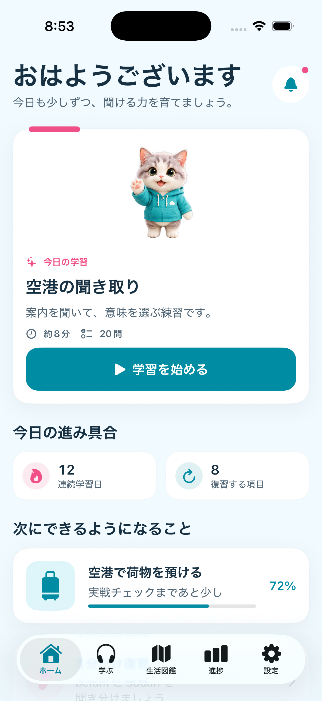
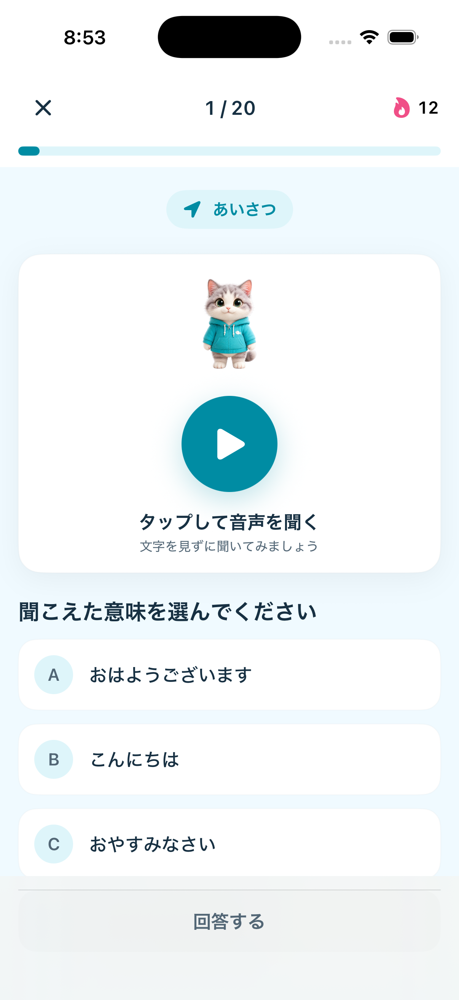
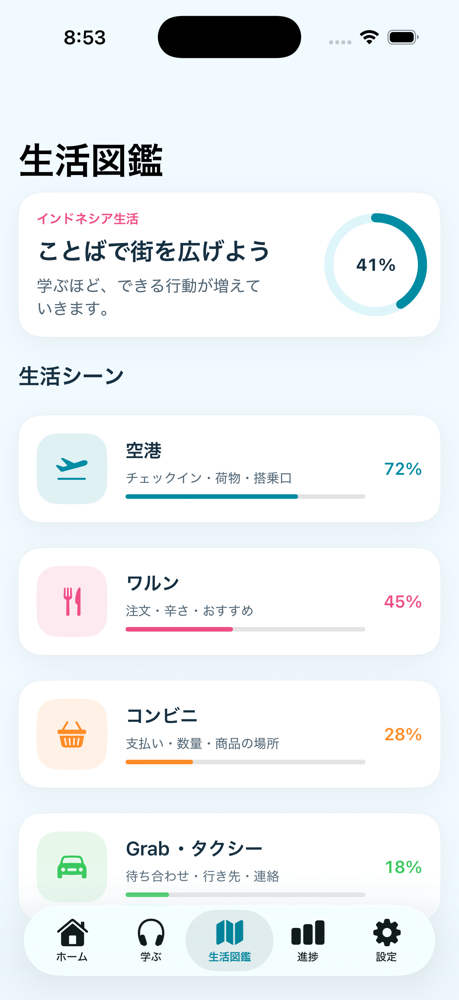
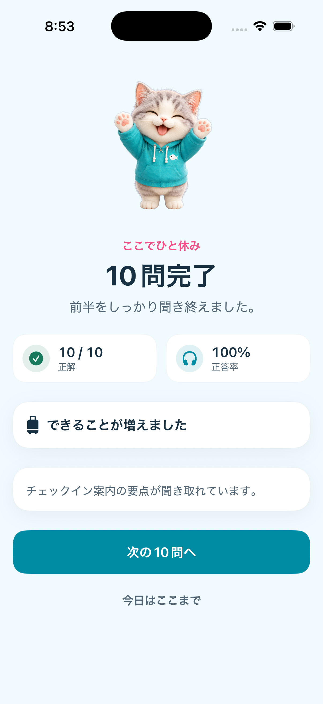
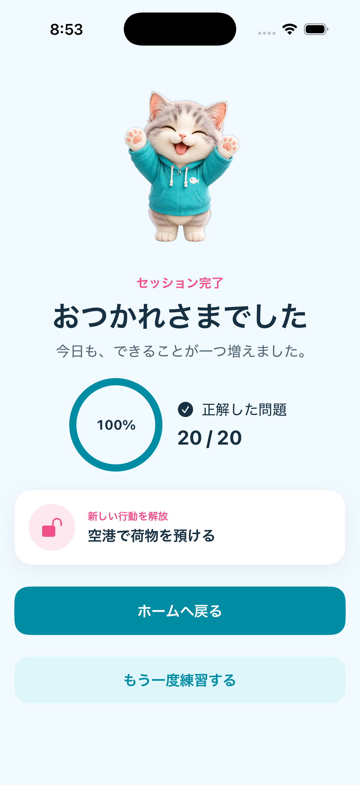
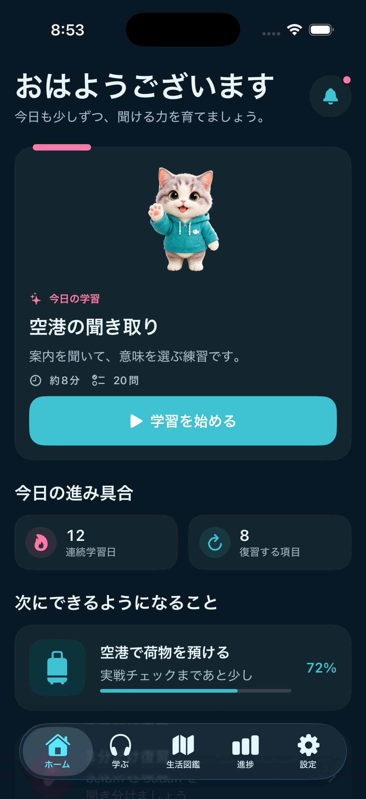
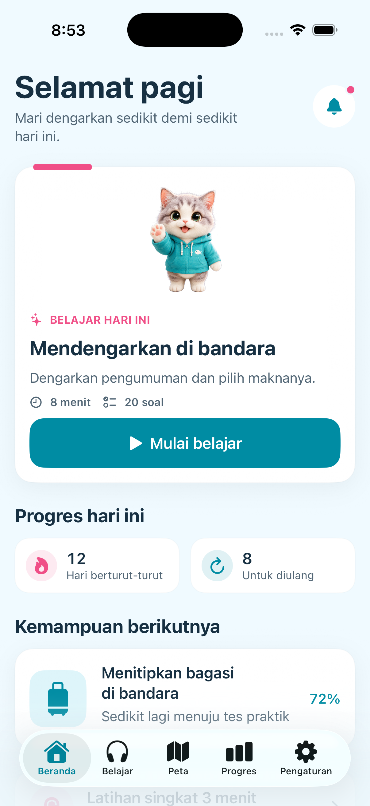
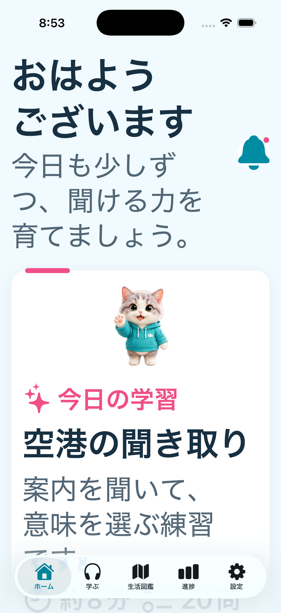

# 画面デザインプロトタイプ

## ステータス

- 実装日: 2026-08-02
- 対象: iPhone縦向き、iOS 17以上
- 検証端末: iPhone 17 Simulator / iOS 26.3.1
- 実装方式: SwiftUI

本プロトタイプは、プロダクト仕様の情報設計、視覚階層、画面遷移、キャラクターの役割を実機相当のSwiftUI画面で確認するための縦切りである。バックエンド、永続化、本番音声再生はまだ接続しない。

## 画面

### ホーム



- 今日の学習を最優先のカードとして表示
- キャラクターは学習開始を支援する位置に置く
- 連続学習日、復習件数、次にできる行動を一画面で確認
- 主要CTAは「学習を始める」の一つ

### 音声問題



- 回答前にインドネシア語本文を表示しない
- 進捗、音声、選択肢、回答の順で視線を誘導
- 選択前の回答ボタンは無効状態
- 回答後のみ、聞こえていた文と解説を表示

### 生活図鑑



- 級ではなく、生活場面と行動の進捗を主役にする
- 空港、ワルン、コンビニ、GrabをMVPカテゴリとして表示
- 各カテゴリで達成率と学べる行動を同時に表示

### 10問中間結果



- 10問を明確な休憩点として表示
- 正答率だけでなく、聞き取れるようになった内容を伝える
- 「次の10問」と「今日はここまで」を同時に提供

### 20問総合結果



- 正答率と正解数を表示
- 新しく解放した行動を成果の中心に置く
- ホームへ戻る操作を主、再練習を副とする

## 表示バリエーション

### ダークモード



システム配色に追従しながら、深い青緑の背景とサーフェスを使う。キャラクターの顔、瞳、鼻、服はライト／ダークで同じ固有色を保つ。

### インドネシア語UI



日本語より長い語句を折り返し、主要CTA、カード、タブで文字切れがないことを確認する。

### 大きな文字



`accessibility-extra-extra-large` で、見出しと本文が省略されず折り返され、画面を縦にスクロールできることを確認する。音声問題から結果までの全フロー検証は次段階で行う。

## 画面遷移

```text
ホーム / 学ぶ
└── 20問セッション
    ├── 問題 1〜10
    ├── 中間結果
    ├── 問題 11〜20
    └── 総合結果
        ├── ホームへ戻る
        └── もう一度練習する

生活図鑑
└── カテゴリ一覧（詳細画面は次段階）
```

## 現在の実装境界

実装済み:

- 5タブの情報設計
- ホーム、学ぶ、生活図鑑、進捗、設定
- 20問の状態遷移
- 中間結果と総合結果
- 日本語・インドネシア語String Catalog
- ライト／ダークのDesign Token
- 参照画像から造形を維持した写実的な透過キャラクター3表情
- VoiceOverラベルと44pt以上の主要操作領域

次段階:

- AVFoundationによる本番音声再生
- 回答直後の永続化と途中復帰
- 実教材パックの読込
- 生活図鑑のカテゴリ詳細
- 残り3状態の個別キャラクター素材追加と全6表情の最終品質調整
- Dynamic TypeとVoiceOverによる全フローの操作検証

参照キャラクター画像は設定資料として保持し、アプリでは参照画像から造形を維持して生成した差し替え可能な透過PNGを使用する。生成元、プロンプト、権利、商用利用条件は本番判定前に記録・確認する。
