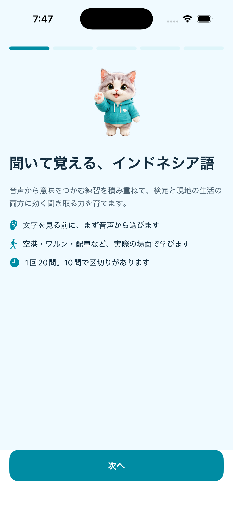
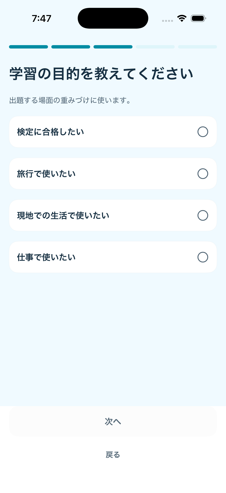
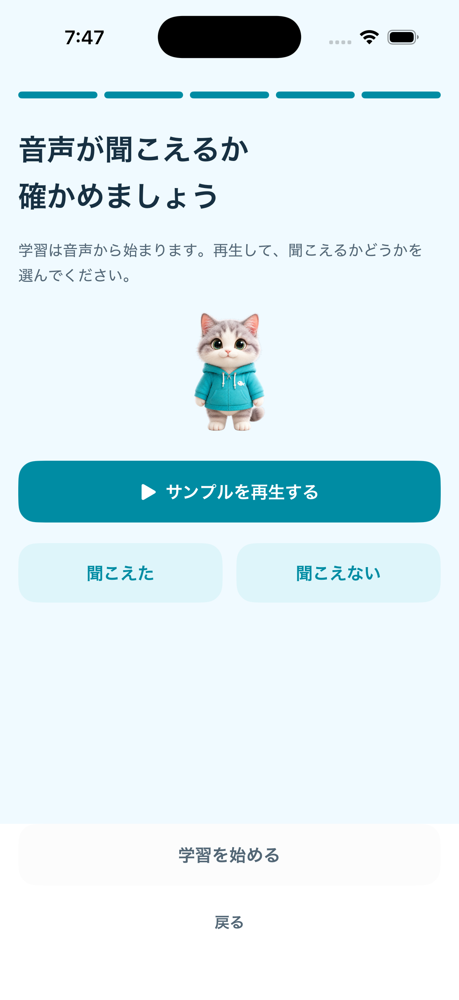
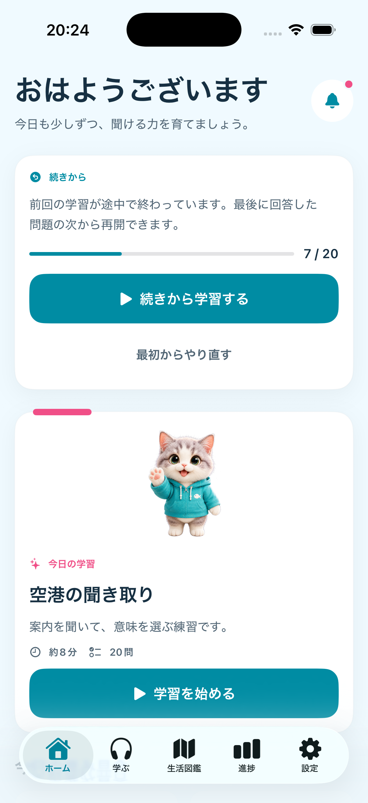
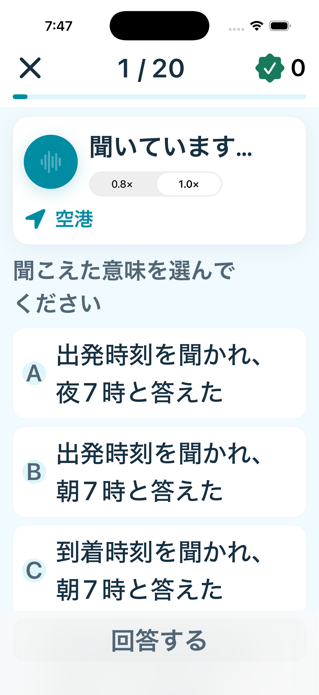
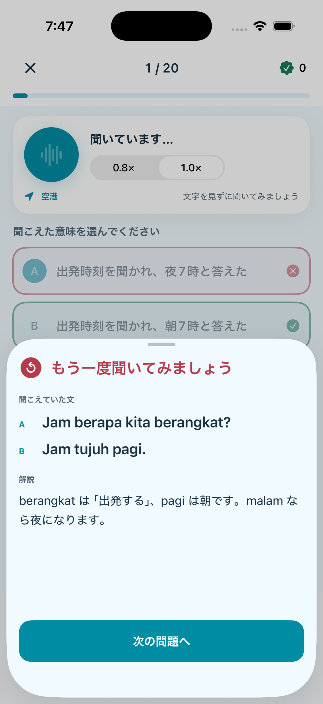
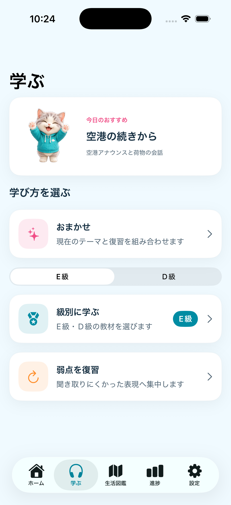
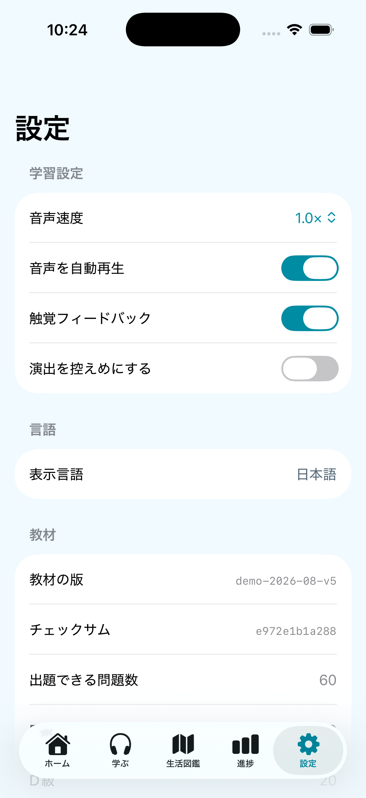
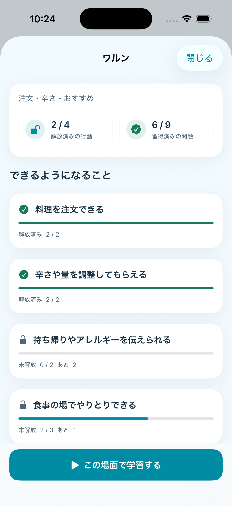

# 画面デザインプロトタイプ

## ステータス

- 実装日: 2026-08-02（画面プロトタイプ）／ 2026-08-21（保存・復帰・音声・キャラクターの動き）／ 2026-08-22（初回導入・ランダム出題・会話問題）
- 対象: iPhone縦向き、iOS 17以上
- 検証端末: iPhone 17 Simulator / iOS 26.3.1
- 実装方式: SwiftUI

本プロトタイプは、プロダクト仕様の情報設計、視覚階層、画面遷移、キャラクターの役割を実機相当のSwiftUI画面で確認するための縦切りである。

2026-08-21 時点で、回答のローカル保存と途中復帰、音声再生、発話に同期したキャラクターの動きを実装した。バックエンドと教材の実音声はまだ接続していない。

## 画面

### 初回導入







- 5画面で、目的の説明 → UI言語 → 学習目的 → 目標級と経験 → 音声の聞こえ確認 の順に進む
- 各手順は戻れる。選択が必要な手順は選ぶまで次へ進めない
- 音声が聞こえない場合の対処を案内し、聞こえなくても学習へ進める
- 選択状態はチェック記号と枠線でも示し、色だけに頼らない

### ホーム


- 今日の学習を最優先のカードとして表示
- キャラクターは学習開始を支援する位置に置く
- 連続学習日、復習件数、次にできる行動を一画面で確認
- 主要CTAは「学習を始める」の一つ

### ホーム（途中の学習がある場合）



- 途中離脱した学習があるときだけ、最上部に「続きから」カードを出す
- 何問まで終わっているかを進捗と数字の両方で示す
- 「続きから学習する」を主、「最初からやり直す」を副として並べる

### 音声問題


- 回答前にインドネシア語本文を表示しない
- **音声操作と選択肢を同時に1画面へ収める**。聞くために選択肢が隠れる構成にしない
- 音声操作は再生ボタンと速度切替だけの横帯にまとめ、キャラクターは置かない
- 進捗、音声、選択肢、回答の順で視線を誘導
- 選択前の回答ボタンは無効状態
- 画面に入ると音声を自動再生する（設定で切り替え可能）
- 再生速度は 0.8× / 1.0× を音声帯の中で切り替える
- 右上は今セッションの正解数。実データのない固定値は表示しない
- 保存に失敗した場合は音声帯の上に警告を出す
- 大きい文字設定では補助文を隠し、操作に必要な要素を優先する



### 回答後の解説



- 回答を確定すると、解説を**前面のポップアップ**で出す。スクロールしないと読めない位置に置かない
- 正誤、聞こえていた文、解説、次への導線を1枚にまとめる
- 会話問題は A / B の記号付きで話者を分けて示す
- 正誤は記号と文言の両方で示し、色だけに頼らない
- ポップアップを閉じた場合も、下部の「解説を見る」から読み直せる

### 学習の入口



- おまかせ・級別・復習の3入口。級別はE級／D級を選んで始める
- 未提供の級（C級以上）はUIに出さない
- 復習は対象件数をバッジで示す

### 教材情報（設定）



- 教材の版、チェックサム、出題できる問題数、級ごとの内訳、自動検査の結果を示す
- 検査に落ちた版は適用されないため、ここで状態を確認できる

### 生活図鑑


- 級ではなく、生活場面と行動の進捗を主役にする
- 空港、ワルン、コンビニ、GrabをMVPカテゴリとして表示
- 各カテゴリで達成率と学べる行動を同時に表示

### 10問中間結果


- 10問を明確な休憩点として表示
- 正答率だけでなく、聞き取れるようになった内容を伝える
- 「次の10問」と「今日はここまで」を同時に提供

### 20問総合結果


- 正答率と正解数を表示
- 新しく解放した行動を成果の中心に置く
- ホームへ戻る操作を主、再練習を副とする

### 生活図鑑


- カテゴリごとに達成率（解放済み行動の割合）を実データで示す
- 復習の時期になった問題がある場合はカテゴリカードに件数を出す
- カテゴリを選ぶと詳細が開く



- 「できるようになること」を行動ごとに並べ、解放済み・未解放を記号と文言で示す
- 未解放の行動には残り件数を出す。ロック理由を推測させない
- 解放判定に使った設定版を画面に示し、根拠を後から再現できるようにする
- 「この場面で学習する」から、級別入口と同じ教材で学習を始められる

## 実装済みの振る舞い

| 振る舞い | 内容 |
| --- | --- |
| 回答直後保存 | 回答確定・区切り通過・再挑戦のたびにローカル保存する |
| 途中復帰 | 強制終了しても、最後に回答した問題の次から再開できる |
| 保存データの破棄 | 教材版違い・出題順違い・重複回答・破損は復帰させず破棄する |
| 音声 | 端末内の合成音声による暫定実装。0.8×/1.0×、自動再生、中断処理 |
| キャラクター | 待機中は呼吸、再生中は発話の拍に同期して口と体が動く |
| 教材 | 40問の母集団から毎回20問を抽選。うち10問は2話者の会話問題 |
| 出題のランダム化 | 出題順と選択肢順をセッションごとに引き直す。正解の位置は固定しない |
| 会話問題 | 話者を分けて順に再生し、回答後の本文は A / B の記号付きで表示する |
| 初回導入 | 仕様の6手順。受け取った内容を保存し、次回以降は表示しない |
| 解説の提示 | 回答直後にポップアップで提示。閉じても「解説を見る」から再表示できる |
| 習得状態 | 回答ごとに記録。1回の正解では習得済みにせず、復習期限も持つ |
| 行動解放 | 関連問題の8割習得で解放。判定に使った設定版を画面に示す |
| 学習の入口 | おすすめ・級別（E/D）・復習・生活図鑑の4つ。教材プールは共通 |
| 教材 | E級40問 + D級20問。公開済みのみ出題し、自動検査とチェックサムで破損を拒否 |

## 表示バリエーション

### ダークモード


システム配色に追従しながら、深い青緑の背景とサーフェスを使う。キャラクターの顔、瞳、鼻、服はライト／ダークで同じ固有色を保つ。

### インドネシア語UI


日本語より長い語句を折り返し、主要CTA、カード、タブで文字切れがないことを確認する。

### 大きな文字


`accessibility-extra-extra-large` で、見出しと本文が省略されず折り返され、画面を縦にスクロールできることを確認する。音声問題から結果までの全フロー検証は次段階で行う。

## 画面遷移

```text
ホーム / 学ぶ
└── 20問セッション
    ├── 問題 1〜10
    ├── 中間結果
    ├── 問題 11〜20
    └── 総合結果
        ├── ホームへ戻る
        └── もう一度練習する

生活図鑑
└── カテゴリ一覧（詳細画面は次段階）
```

## 現在の実装境界

実装済み:

- 5タブの情報設計
- ホーム、学ぶ、生活図鑑、進捗、設定
- 20問の状態遷移
- 中間結果と総合結果
- 日本語・インドネシア語String Catalog
- ライト／ダークのDesign Token
- 参照画像から造形を維持した写実的な透過キャラクター3表情
- VoiceOverラベルと44pt以上の主要操作領域

次段階:

- AVFoundationによる本番音声再生
- 回答直後の永続化と途中復帰
- 実教材パックの読込
- 生活図鑑のカテゴリ詳細
- 残り3状態の個別キャラクター素材追加と全6表情の最終品質調整
- Dynamic TypeとVoiceOverによる全フローの操作検証

参照キャラクター画像は設定資料として保持し、アプリでは参照画像から造形を維持して生成した差し替え可能な透過PNGを使用する。生成元、プロンプト、権利、商用利用条件は本番判定前に記録・確認する。
